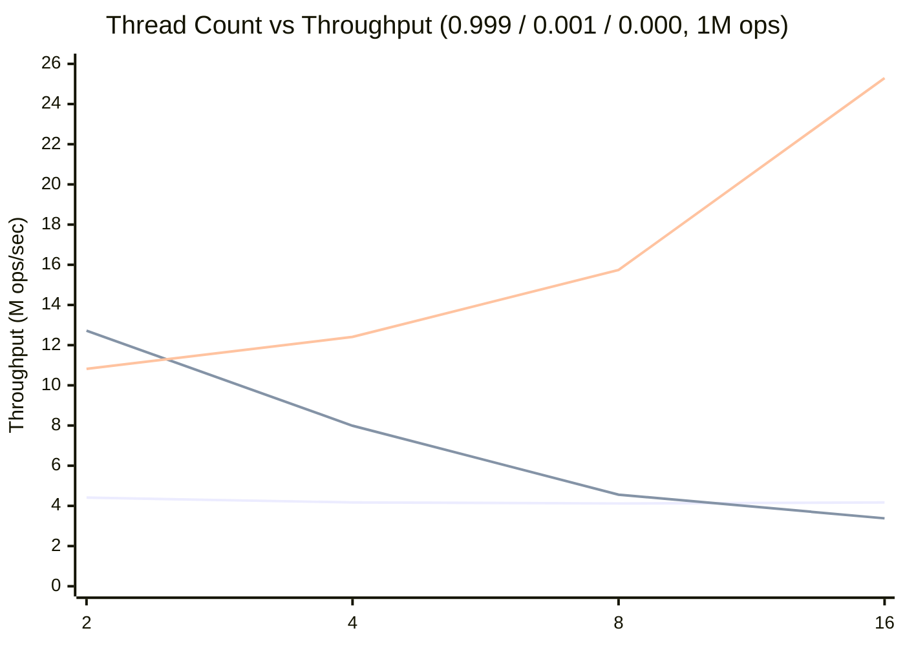
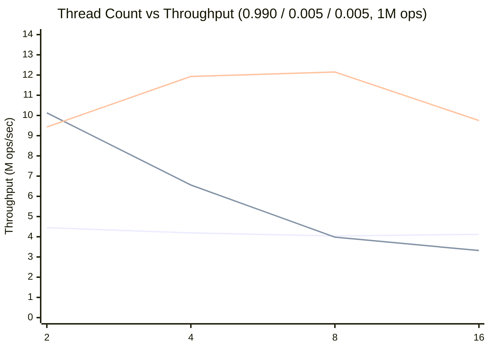
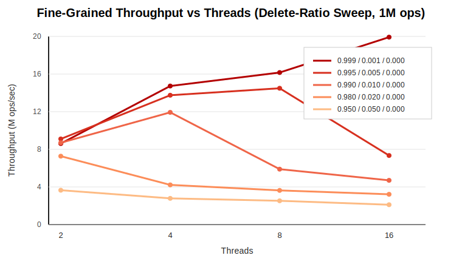
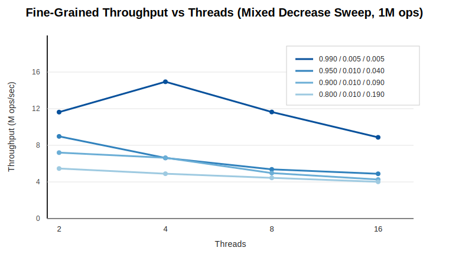
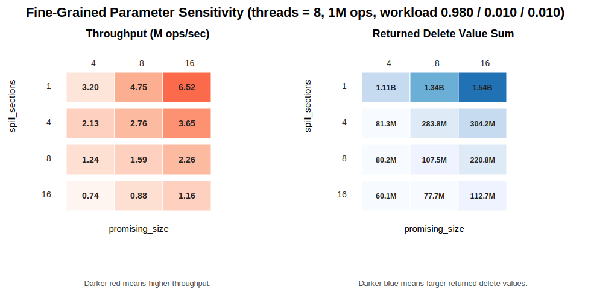

# Parallel-Fibonacci-Heap
CMU 15618 Course Project (Spring 26)

## Experimental Setup

### Experiment Matrix

The benchmark uses the following settings:

- operation counts:
  - `10,000`
  - `100,000`
  - `1,000,000`
- thread counts:
  - `2`
  - `4`
  - `8`
  - `16`
- operation mixes (`insert / deleteMin / decreaseKey`):
  - delete-ratio sweep:
    - `0.999 / 0.001 / 0.0`
    - `0.995 / 0.005 / 0.0`
    - `0.990 / 0.010 / 0.0`
    - `0.980 / 0.020 / 0.0`
    - `0.950 / 0.050 / 0.0`
  - mixed delete/decrease sweep:
    - `0.990 / 0.005 / 0.005`
    - `0.980 / 0.010 / 0.010`
    - `0.950 / 0.010 / 0.040`
    - `0.900 / 0.010 / 0.090`
    - `0.800 / 0.010 / 0.190`

### Workload Generation

For each run:

- the operation trace is generated from a fixed random seed;
- keys are generated as random positive integers;
- the same seed and workload mix are used across compared implementations;
- a warmup phase inserts an initial set of keys before timed execution begins.

### Execution Method

The pre-generated trace is executed in parallel with static chunking across worker threads. This avoids adding benchmark-side dynamic scheduling overhead to the measured heap operations.

### Measured Metrics

Each run records the following metrics:

- `time_ms`
- `throughput_ops_per_sec`

To track the quality of relaxed `deleteMin`, the benchmark also records:

- `delete_value_sum`

### Compared Implementations

The main experiments compare:

- coarse-grained synchronized Fibonacci heap
- fine-grained synchronized Fibonacci heap
- binary heap baseline

All three implementations are evaluated under the same operation counts, thread counts, seeds, and workload mixes.

## Representative Results

The tables below highlight one insert-dominated workload that still includes `deleteMin`.
This workload is useful because it is not pure insertion, but it still exposes the scalability
advantage of the fine-grained design clearly.

### Workload: `0.999 / 0.001 / 0.000`

#### Throughput Trend (`ops = 1000000`)

The fine-grained heap becomes the best-performing implementation from `4` threads onward
and continues to improve through `16` threads, while the coarse-grained heap degrades
steadily and the binary heap remains relatively flat.

#### `ops = 10000`

| Threads | Execution Time (Binary, sec) | Execution Time (Coarse, sec) | Execution Time (Fine, sec) | Throughput (Binary) | Throughput (Coarse) | Throughput (Fine) |
|---:|---:|---:|---:|---:|---:|---:|
| 2  | 0.00337 | 0.00189 | 0.00214 | 2.96M | 5.29M | 4.67M |
| 4  | 0.00291 | 0.00276 | 0.00154 | 3.43M | 3.62M | 6.51M |
| 8  | 0.00321 | 0.00347 | 0.00143 | 3.12M | 2.88M | 6.99M |
| 16 | 0.00385 | 0.00411 | 0.00160 | 2.60M | 2.43M | 6.26M |

#### `ops = 100000`

| Threads | Execution Time (Binary, sec) | Execution Time (Coarse, sec) | Execution Time (Fine, sec) | Throughput (Binary) | Throughput (Coarse) | Throughput (Fine) |
|---:|---:|---:|---:|---:|---:|---:|
| 2  | 0.02434 | 0.00851 | 0.01120 | 4.11M | 11.75M | 8.93M |
| 4  | 0.03356 | 0.01444 | 0.00812 | 2.98M | 6.92M | 12.32M |
| 8  | 0.02327 | 0.02386 | 0.00632 | 4.30M | 4.19M | 15.84M |
| 16 | 0.02414 | 0.03020 | 0.00548 | 4.14M | 3.31M | 18.24M |

#### `ops = 1000000`

| Threads | Execution Time (Binary, sec) | Execution Time (Coarse, sec) | Execution Time (Fine, sec) | Throughput (Binary) | Throughput (Coarse) | Throughput (Fine) |
|---:|---:|---:|---:|---:|---:|---:|
| 2  | 0.22653 | 0.07864 | 0.09241 | 4.41M | 12.72M | 10.82M |
| 4  | 0.23999 | 0.12518 | 0.08060 | 4.17M | 7.99M | 12.41M |
| 8  | 0.24295 | 0.21948 | 0.06351 | 4.12M | 4.56M | 15.74M |
| 16 | 0.23958 | 0.29629 | 0.03954 | 4.17M | 3.38M | 25.29M |

### Discussion

- The fine-grained heap scales much more strongly than both baselines on this workload.
  At `ops = 1000000`, its throughput rises from `10.82M` at `2` threads to `25.29M` at `16` threads,
  while execution time drops from `0.092` seconds to `0.040` seconds.
- The coarse-grained heap degrades steadily as thread count grows, which is consistent with
  lock contention on the global critical path. Its execution time increases from `0.079`
  seconds at `2` threads to `0.296` seconds at `16` threads.
- The binary heap remains comparatively flat across thread counts, so it serves as a useful
  reference point for a non-sectioned concurrent priority queue baseline.

## Representative Mixed Insert/Decrease Results

The next workload keeps the trace strongly insert-dominated while introducing both
`deleteMin` and `decreaseKey`: `0.990 / 0.005 / 0.005`. It serves as a useful bridge
between the very light delete case above and the heavier sweeps below, because the
fine-grained heap still outperforms both baselines but no longer scales monotonically
to the highest thread count.

#### Throughput Trend (`ops = 1000000`)

The fine-grained heap still outperforms both baselines, but unlike the lighter
insert-heavy case, its improvement is more limited and no longer monotonic beyond
mid-range thread counts.

### `ops = 10000`

| Threads | Execution Time (Binary, sec) | Execution Time (Coarse, sec) | Execution Time (Fine, sec) | Throughput (Binary) | Throughput (Coarse) | Throughput (Fine) |
|---:|---:|---:|---:|---:|---:|---:|
| 2  | 0.00321 | 0.00242 | 0.00206 | 3.11M | 4.14M | 4.84M |
| 4  | 0.00317 | 0.00312 | 0.00178 | 3.16M | 3.21M | 5.63M |
| 8  | 0.00322 | 0.00369 | 0.00163 | 3.11M | 2.71M | 6.12M |
| 16 | 0.00369 | 0.00410 | 0.00144 | 2.71M | 2.44M | 6.93M |

### `ops = 100000`

| Threads | Execution Time (Binary, sec) | Execution Time (Coarse, sec) | Execution Time (Fine, sec) | Throughput (Binary) | Throughput (Coarse) | Throughput (Fine) |
|---:|---:|---:|---:|---:|---:|---:|
| 2  | 0.02773 | 0.01471 | 0.01493 | 3.61M | 6.80M | 6.70M |
| 4  | 0.02513 | 0.02348 | 0.01151 | 3.98M | 4.26M | 8.68M |
| 8  | 0.02898 | 0.03131 | 0.01154 | 3.45M | 3.19M | 8.67M |
| 16 | 0.03564 | 0.03207 | 0.00856 | 2.81M | 3.12M | 11.68M |

### `ops = 1000000`

| Threads | Execution Time (Binary, sec) | Execution Time (Coarse, sec) | Execution Time (Fine, sec) | Throughput (Binary) | Throughput (Coarse) | Throughput (Fine) |
|---:|---:|---:|---:|---:|---:|---:|
| 2  | 0.22494 | 0.09870 | 0.10602 | 4.45M | 10.13M | 9.43M |
| 4  | 0.23859 | 0.15234 | 0.08384 | 4.19M | 6.56M | 11.93M |
| 8  | 0.24745 | 0.25114 | 0.07668 | 4.04M | 3.98M | 12.15M |
| 16 | 0.24290 | 0.30133 | 0.13731 | 4.12M | 3.32M | 9.75M |

### Discussion

- At `ops = 10000`, the mixed workload already shows the same qualitative trend as the
  larger runs: the fine-grained heap improves with thread count, while the baselines are
  mostly flat or declining.
- At `ops = 100000`, the fine-grained heap separates more clearly from the baselines and
  becomes the best-performing implementation from `4` threads onward.
- At `ops = 1000000`, the fine-grained heap still improves from `9.43M` at `2` threads
  to `12.15M` at `8` threads, and remains above both baselines at `16` threads with
  `9.75M`. However, unlike the lighter insert-heavy workload, the improvement is no longer
  monotonic, indicating that additional delete/decrease coordination has already started
  to reduce scalability.
- This contrast with the lighter `0.999 / 0.001 / 0.000` workload is the main point of
  the section. Once moderate `deleteMin` and `decreaseKey` pressure are both present, the
  shared coordination path becomes visible and the best thread count shifts left.

## Delete-Ratio Sweep

The following table isolates the fine-grained heap and increases the `deleteMin` ratio
while keeping `decreaseKey = 0`. This makes it easier to locate the scalability turning point
of the current design.

### Fine-Grained Heap, `ops = 1000000`, `spill_sections = 1`, `promising_size = 8`

| Workload (`insert / deleteMin / decreaseKey`) | Throughput (2 threads) | Throughput (4 threads) | Throughput (8 threads) | Throughput (16 threads) |
|---|---:|---:|---:|---:|
| `0.999 / 0.001 / 0.000` | 8.61M | 14.73M | 16.16M | 19.92M |
| `0.995 / 0.005 / 0.000` | 9.10M | 13.75M | 14.49M | 7.34M |
| `0.990 / 0.010 / 0.000` | 8.70M | 11.93M | 5.89M | 4.70M |
| `0.980 / 0.020 / 0.000` | 7.27M | 4.22M | 3.63M | 3.22M |
| `0.950 / 0.050 / 0.000` | 3.65M | 2.79M | 2.53M | 2.11M |

### Discussion

- At `0.999 / 0.001 / 0.000`, the fine-grained heap still behaves like a highly scalable
  insert-dominated structure: throughput continues to improve all the way to `16` threads.
- At `0.995 / 0.005 / 0.000`, the best point shifts left to `8` threads, and the `16`-thread
  result drops sharply.
- At `0.990 / 0.010 / 0.000`, the best point shifts further left to `4` threads.
- At `0.980 / 0.020 / 0.000` and `0.950 / 0.050 / 0.000`, the best result already occurs at
  `2` threads, and additional threads only reduce throughput.
- This pattern strongly suggests that the current fine-grained implementation scales well
  only while execution remains dominated by section-local inserts. As delete pressure rises,
  the serialized coordination in the `deleteMin` path becomes the dominant bottleneck.

## Mixed Delete/Decrease Sweep

The next table keeps the fine-grained heap configuration fixed and increases the amount of
`decreaseKey` work in the trace. This complements the delete-ratio sweep above and shows
how reinsertion-based decrease operations shift the performance optimum toward lower thread
counts.

### Fine-Grained Heap, `ops = 1000000`, `spill_sections = 1`, `promising_size = 8`

| Workload (`insert / deleteMin / decreaseKey`) | Throughput (2 threads) | Throughput (4 threads) | Throughput (8 threads) | Throughput (16 threads) | Best Thread Count |
|---|---:|---:|---:|---:|---:|
| `0.990 / 0.005 / 0.005` | 9.30M | 12.80M | 10.35M | 6.32M | 4 |
| `0.950 / 0.010 / 0.040` | 7.17M | 5.27M | 4.30M | 3.93M | 2 |
| `0.900 / 0.010 / 0.090` | 6.02M | 5.32M | 3.97M | 3.41M | 2 |
| `0.800 / 0.010 / 0.190` | 4.37M | 3.99M | 3.56M | 3.21M | 2 |

### Discussion

- With a light mixed workload (`0.990 / 0.005 / 0.005`), the fine-grained heap still
  benefits from parallelism up to `4` threads, but the best point has already shifted left
  relative to the lighter insert-heavy workloads.
- As the `decreaseKey` ratio increases, the performance optimum shifts further left to
  `2` threads.
- This mirrors the delete-ratio sweep above, but the turning point appears earlier because
  reinsertion-based `decreaseKey` also increases pressure on version tracking, stale cleanup,
  and the shared `deleteMin` coordination path.

## Parameter Sensitivity

The tables below examine the fine-grained heap under a fixed mixed workload while varying
the candidate-pool size (`promising_size`) and the number of sections scanned during refill
(`spill_sections`).

### Fine-Grained Heap, `threads = 8`, `ops = 1000000`, workload `0.980 / 0.010 / 0.010`

#### Throughput (`ops/sec`)

| `spill_sections` | `promising_size = 4` | `promising_size = 8` | `promising_size = 16` |
|---:|---:|---:|---:|
| 1  | 3.20M | 4.75M | 6.52M |
| 4  | 2.13M | 2.76M | 3.65M |
| 8  | 1.24M | 1.59M | 2.26M |
| 16 | 0.74M | 0.88M | 1.16M |

#### Returned Delete Value Sum

| `spill_sections` | `promising_size = 4` | `promising_size = 8` | `promising_size = 16` |
|---:|---:|---:|---:|
| 1  | 1.11B | 1.34B | 1.54B |
| 4  | 81.3M | 283.8M | 304.2M |
| 8  | 80.2M | 107.5M | 220.8M |
| 16 | 60.1M | 77.7M | 112.7M |

### Discussion

- `spill_sections` is the dominant performance knob. Increasing section coverage sharply
  reduces throughput, even when `promising_size` is held fixed.
- `promising_size` has the opposite effect in this implementation: increasing it
  consistently improves throughput. This suggests that a larger candidate pool reduces the
  frequency of refill and maintenance work.
- The quality tradeoff remains visible in `delete_value_sum`. Larger `spill_sections`
  reduce returned delete values, indicating more accurate candidate selection, while larger
  `promising_size` pushes the design back toward higher-throughput, more relaxed behavior.
- Together, these results suggest that `spill_sections = 1` is the most favorable
  throughput-oriented configuration, while `spill_sections > 1` should be viewed as a
  quality-oriented setting with a significant performance cost.

## Overall Takeaways

- The fine-grained heap performs best when execution is still dominated by section-local
  inserts. In that regime it separates clearly from both the coarse-grained Fibonacci heap
  and the binary heap baseline.
- As `deleteMin` pressure increases, the scalability turning point shifts steadily toward
  lower thread counts. The same pattern appears even earlier when `decreaseKey` is added.
- The current implementation therefore has an asymmetric profile: the insert path scales
  well, but the shared delete/decrease path remains the primary bottleneck at higher
  contention levels.
- Parameter sensitivity results reinforce this interpretation. Broader refill coverage
  (`spill_sections`) improves returned delete quality but is expensive, while a larger
  candidate pool (`promising_size`) helps amortize maintenance and improves throughput in
  the current design.
